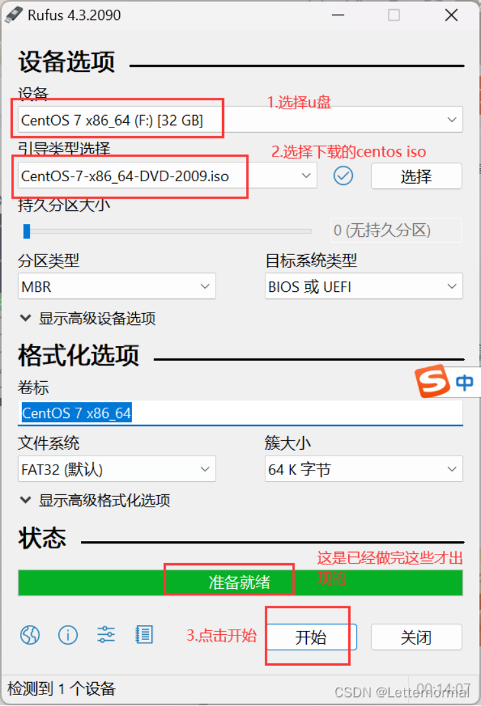

- [1、电脑安装CentOS系统（相关工具在阿里云盘资源盘都有保存）](#1电脑安装centos系统相关工具在阿里云盘资源盘都有保存)
- [2、CentOS基础配置](#2centos基础配置)
  - [关闭selinux](#关闭selinux)
  - [关闭虚拟机的防火墙](#关闭虚拟机的防火墙)
  - [安装net-tools和openssh](#安装net-tools和openssh)
  - [在xshell中安装centos常用工具包](#在xshell中安装centos常用工具包)
  - [安装docker-ce社区版](#安装docker-ce社区版)
  - [配置docker镜像加速](#配置docker镜像加速)
  - [docker配置宿主机转发](#docker配置宿主机转发)
  - [安装一下常见的包](#安装一下常见的包)
- [CentOS7离线安装Python3](#centos7离线安装python3)
  - [开始安装](#开始安装)
- [centos内更新SQLite的版本解决版本过低导致的BUG](#centos内更新sqlite的版本解决版本过低导致的bug)
  - [提前准备](#提前准备)
  - [开始安装](#开始安装-1)


# 1、电脑安装CentOS系统（相关工具在阿里云盘资源盘都有保存）
- U盘工具（rufus-4.5）
- 
- centos系统（CentOS-7-x86_64-DVD-2009.iso）
- [北京外国语大学开源软件镜像站——centos
](https://mirrors.bfsu.edu.cn/centos/7.9.2009/isos/x86_64/)
- [镜像站
](https://mirrors.bfsu.edu.cn/centos/7.9.2009/isos/x86_64/)

联想电脑按下 F2 进入boot，选择Boot-u盘启动，简单设置安装即可

# 2、CentOS基础配置
## 关闭selinux

```bash
临时关闭
  setenforce 0

  永久关闭
  vi /etc/selinux/config
  设置SELINUX=disabled
```
## 关闭虚拟机的防火墙

```bash
查看防火墙状态
systemctl status firewalld
关闭
systemctl stop firewalld
关闭开机启动防火墙
systemctl disable firewalld
```
## 安装net-tools和openssh

```bash
yum update (更新一下）
yum install -y net-tools
yum install -y openssh-server

设置开机启动
systemctl start sshd.service
systemctl enable sshd.service

安装xshell，远程连接虚拟机
```
## 在xshell中安装centos常用工具包
```bash
yum install -y wget
yum install -y bash-completion vim lrzsz wget expect net-tools nc nmap tree dos2unix htop iftop iotop unzip telnet sl psmisc nethogs glances bc ntpdate openldap-devel
```
## 安装docker-ce社区版

```bash
curl -o /etc/yum.repos.d/Centos-7.repo http://mirrors.aliyun.com/repo/Centos-7.repo

curl -o /etc/yum.repos.d/docker-ce.repo http://mirrors.aliyun.com/docker-ce/linux/centos/docker-ce.repo

yum clean all && yum makecache

yum install -y docker-ce

安装指定版本

yum install -y docker-ce-23.0.6

设置docker开机启动

systemctl enable docker

systemctl start docker

systemctl restart docker

systemctl stop docker
```
## 配置docker镜像加速
[阿里云镜像加速器](https://cr.console.aliyun.com/cn-shanghai/instances/mirrors?spm=a2c6h.12873639.article-detail.7.358a56135tZGng)

```bash
sudo mkdir -p /etc/docker
sudo tee /etc/docker/daemon.json <<-'EOF'
{
  "registry-mirrors": [""]
}
EOF
sudo systemctl daemon-reload
sudo systemctl restart docker
```
## docker配置宿主机转发

```bash
cat <<EOF > /etc/sysctl.d/docker.conf
net.bridge.bridge-nf-call-ip6tables = 1
net.bridge.bridge-nf-call-iptables = 1
net.ipv4.conf.default.rp_filter = 0
net.ipv4.conf.all.rp_filter = 0
net.ipv4.ip_forward=1
EOF
```
## 安装一下常见的包

```bash
yum install libffi-devel -y
yum install zlib-devel bzip2-devel openssl-devel ncurses-devel sqlite-devel readline-devel tk-devel gcc make

```
---
# CentOS7离线安装Python3
提前准备好python包的安装文件
- 阿里云存有 Python-3.9.6.tar.xz
[pythonftp下载](https://www.python.org/ftp/python/3.8.12/)
## 开始安装
1、先查看系统python的位置在哪儿
```bash
whereis python
```
2、下载python3的包之前，要先安装相关的依赖包，用于下载编译python3：

```
yum install libffi-devel -y
yum install zlib-devel bzip2-devel openssl-devel ncurses-devel sqlite-devel readline-devel tk-devel gcc make
```
> （没有提前安装上述内容可能会导致报错ModuleNotFoundError: No module named '_ctypes‘）
原因：Python3中有个内置模块叫ctypes，它是Python3的外部函数库模块，它提供兼容C语言的数据类型，并通过它调用Linux系统下的共享库(Shared library)，此模块需要使用CentOS7系统中外部函数库(Foreign function library)的开发链接库(头文件和链接库)。
由于在CentOS7系统中没有安装外部函数库(libffi)的开发链接库软件包，所以在安装pip的时候就报了"ModuleNotFoundError: No module named '_ctypes'"的错误。

[参考：ModuleNotFoundError: No module named ‘_ctypes‘报错解决方案](https://blog.csdn.net/weixin_37960614/article/details/131369048)

3、默认的centos7是没有安装pip，先添加epel扩展源

```
yum -y install epel-release
yum install python-pip
```
4、进入到python包的文件夹内，编译python3源码包，解压

```
xz -d Python-3.9.6.tar.xz
tar -xf Python-3.9.6.tar

cd Python-3.9.6

./configure prefix=/usr/local/python3    # 安装的位置

make && make install
```
5、安装依赖zlib、zlib-deve

```
yum install zlib zlib
yum install zlib zlib-devel
```
**最后没提示出错，就代表正确安装了，在/usr/local/目录下就会有python3目录**

6、添加软链接，将原来的链接备份

```
mv /usr/bin/python /usr/bin/python.bak
```
7、添加python3和pip3的软链接

```
ln -s /usr/local/python3/bin/python3.9 /usr/bin/python3
ln -s /usr/local/python3/bin/pip3.9 /usr/bin/pip3
```
测试是否安装成功了

```
python3 -V
```
8、更改yum配置，因为其要用到python2才能执行，否则会导致yum不能正常使用

```
vi /usr/bin/yum
```
把第一行的#! /usr/bin/python 修改为如下

```
#! /usr/bin/python2
```
还有一个地方也需要修改

```
vi /usr/libexec/urlgrabber-ext-down
```
把第一行的#! /usr/bin/python 修改如下

```
#! /usr/bin/python2
```
启动python2

```
python2
```
启动python3

```
python3
```
[参考：Centos安装python3详细教程](https://blog.csdn.net/qq_32742573/article/details/119849634)

# centos内更新SQLite的版本解决版本过低导致的BUG
## 提前准备
先下载SQLite包 [SQLite官网下载](https://sqlite.org/download.html)
==阿里云存有sqlite-autoconf-3280000.tar.gz包==
也可用命令下载

```
wget http://www.sqlite.org/2019/sqlite-autoconf-3280000.tar.gz
```
## 开始安装
解压并编译
```
tar zxvf sqlite-autoconf-3280000.tar.gz -C /usr/src/    将文件解压到指定位置  （不加-C /usr/src/  就是将文件解压到当前位置）
cd /usr/src/sqlite-autoconf-3280000/
./configure --prefix=/usr/local/sqlite
make && make install

可选：
make clean   # 清除缓存
ls -la sqlite*  # 查看sqlite已经存在的软连接 需要进入相关目录
```
替换旧版SQLite：

```
mv /usr/bin/sqlite3 /usr/bin/sqlite3.bak    备份一下
ln -s /usr/local/sqlite/bin/sqlite3  /usr/bin/sqlite3   软链接
```
修改共享库：

```
vim /etc/profile
export LD_LIBRARY_PATH="/usr/local/sqlite/lib"    在文件后加上
```
让配置生效：

```
source /etc/profile
```
确认SQLite版本：

```
sqlite3 --version
```
在Python中确认SQLite版本：

```
python3 -c "import sqlite3; print(sqlite3.sqlite_version)"
```
升级完成，即可解决上述BUG