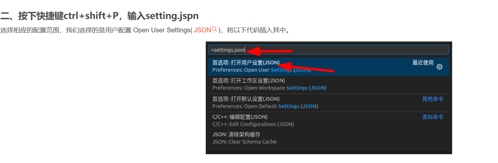

- [VSCode连接虚拟机](#vscode连接虚拟机)
- [Vscode插件todo-tree基本配置](#vscode插件todo-tree基本配置)

# VSCode连接虚拟机
1. 安装插件——Remote Development插件
2. 打开SSH并配置
- 
- Host CentosNat (自定义名称)
  HostName 192.168.3.128 (IP地址)
  User root (用户名)
  PORT 22
  这里port是端口号，如果连接两台linux虚拟机的时候记得在配置文件里面都要写上port端口号 一般默认22端口可多开使用！！！
- 
- 
- 
- 
- 

# Vscode插件todo-tree基本配置
1. 找到配置地址
   - 
2. 常设配置
```json
{
    "remote.SSH.remotePlatform": {
        "alias": "linux",
        "CentosNat": "linux"
    },
    "editor.codeActionsOnSave": {},
    "notebook.codeActionsOnSave": {

    },

    // todo-tree-config
    "todo-tree.regex.regex": "(//|#|<!--|;|/\\*|^|^\\s*(-|\\d+.))\\s*($TAGS)",
    // 是否区分大小写
    "todo-tree.regex.regexCaseSensitive": false,
    //在资源管理器视图中显示树
    "todo-tree.tree.showInExplorer": true,
    "todo-tree.general.tags": [
        "bug",
        "HACK",
        "FIXME",
        "TODO",
        "DONE",
        "tag",
        "XXX",
        "[ ]",
        "[x]"
    ],
    "todo-tree.highlights.defaultHighlight": {
        "icon": "checklist",
        "type": "tag",
        "foreground": "white",
        "background": "Orange",
        "opacity": 50,
        "iconColour": "Orange",
        "rulerColour": "Orange"
    },
    "todo-tree.highlights.customHighlight": {
        "TODO": {
            "icon": "check",
            "gutterIcon": true,
            "type": "line"
        },
        "FIXME": {
            "foreground": "black",
            // "iconColour": "yellow",
            "gutterIcon": true,
            "background": "red",
            "icon": "beaker",
            "rulerColour": "red",
            "iconColour": "red",
            "opacity": 50
        },
        "tag": {
            "background": "Magenta",
            "icon": "pin",
            "rulerColour": "Magenta",
            "iconColour": "Magenta",
            "rulerLane": "full",
            "opacity": 50,
        },
        "done": {
            "background": "DarkTurquoise",
            "icon": "verified",
            "rulerColour": "DarkTurquoise",
            "iconColour": "DarkTurquoise",
            "opacity": 50,
        },
        "bug": {
            "background": "green",
            "icon": "bug",
            "rulerColour": "green",
            "iconColour": "green",
            "opacity": 50,
        }
    }

}
```
3. 我使用的设置
```json
//todo-tree-config
    "todo-tree.regex.regex": "(//|#|<!--|;|/\\*|^|^\\s*(-|\\d+.))\\s*($TAGS)",
    // 是否区分大小写
    "todo-tree.regex.regexCaseSensitive": false,
    ////在树中显示待办事项的计数
    "todo-tree.tree.showCountsInTree": true,
    "todo-tree.general.tags": [
        "TODO",
        "BUG",
        "NOTE",
        "FIXME"
    ],
    "todo-tree.highlights.defaultHighlight": {
        "icon": "checklist",
        "type": "tag",
        "foreground": "white",
        "background": "Orange",
        "opacity": 50,
        "iconColour": "Orange",
        "rulerColour": "Orange"
    },
    "todo-tree.highlights.customHighlight": {
        "TODO": {
            "icon": "check",
            "gutterIcon": true,
            "type": "line",
            "foreground": "black",
            // "iconColour": "yellow",
            "background": "Orange",
            "rulerColour": "Orange",
            "iconColour": "Orange",
            "opacity": 50
        },
        "FIXME": {
            "foreground": "black",
            "gutterIcon": true,
            "background": "yellow",
            "icon": "beaker",
            "rulerColour": "yellow",
            "iconColour": "yellow",
            "opacity": 50
        },
        "NOTE": {
            "foreground": "black",
            "gutterIcon": true,
            "background": "white",
            "icon": "note",
            "rulerColour": "white",
            "iconColour": "white",
            "opacity": 50,
        },
        "BUG": {
            "foreground": "white",
            "gutterIcon": true,
            "background": "red",
            "icon": "bug",
            "rulerColour": "red",
            "iconColour": "red",
            "opacity": 50,
        }
    }
```

标记说明：
- TODO: 用来标记待办的地方。常常在有些地方，我们的功能并没有实现，使用ToDo标记我们可以快速定位需要实现的部分。
- HACK: 用来标记可能需要更改的地方。在写代码的时候，有的地方我们并不确定他是正确的，可能未来有所更改，这时候可以使用HACK标记。
- NOTE: 添加一些说明文字。
- INFO: 用来表达一些信息。
- TAG: 用来创建一些标记。
- XXX: 用来标记一些草率实现的地方。在写代码的时候，有些地方需要频繁修改，这时候使用XXX标记。
- BUG: 用来标记BUG~
- FIXME: 用来标记一些需要修复的位置，可以快速定位。

[todo-tree文档说明地址](https://github.com/Gruntfuggly/todo-tree#markdown-support)