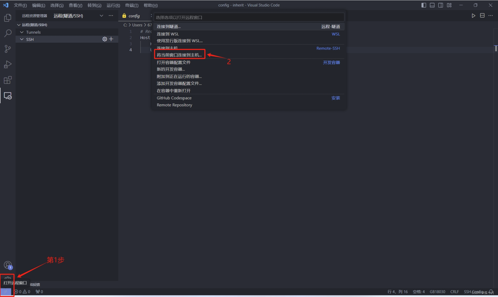
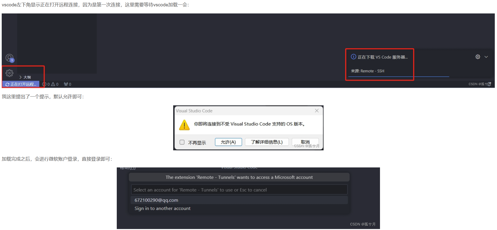
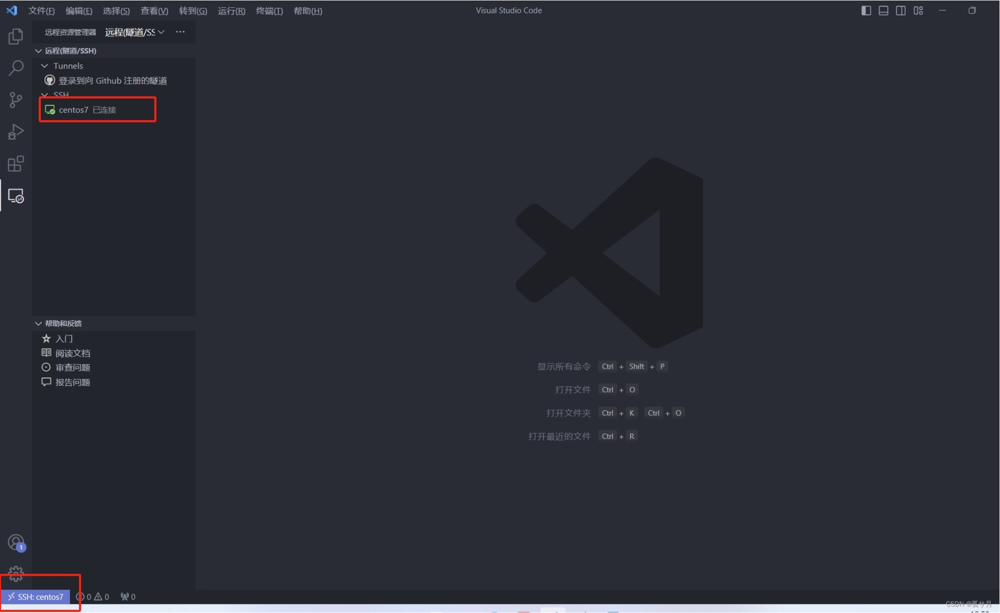
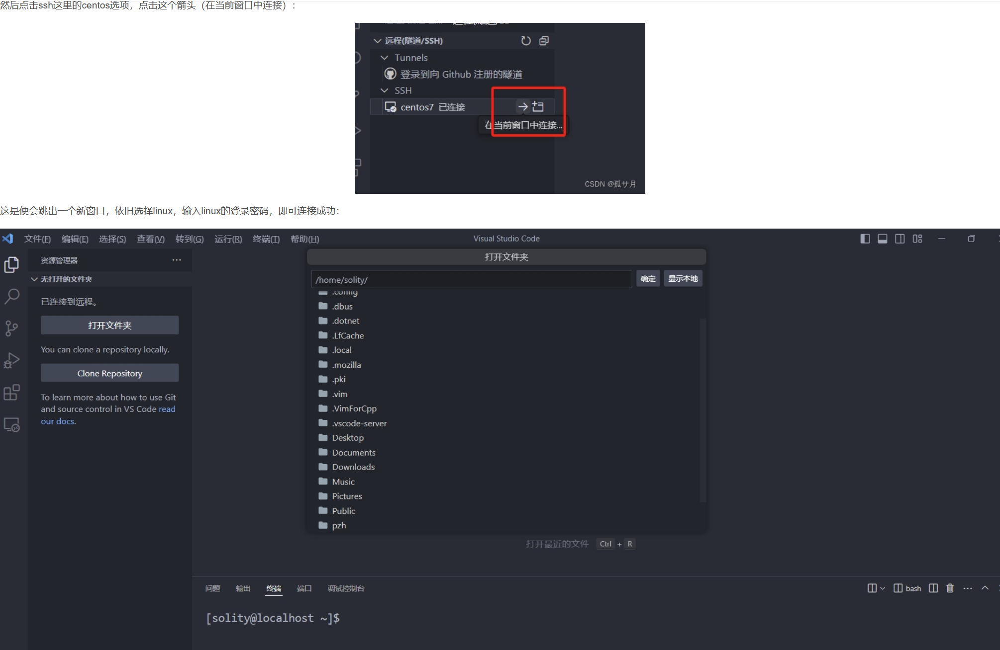

- [VSCode连接虚拟机](#vscode连接虚拟机)

# VSCode连接虚拟机
1. 安装插件——Remote Development插件
2. 打开SSH并配置
- 
- Host CentosNat (自定义名称)
  HostName 192.168.3.128 (IP地址)
  User root (用户名)
  PORT 22
  这里port是端口号，如果连接两台linux虚拟机的时候记得在配置文件里面都要写上port端口号 一般默认22端口可多开使用！！！
- 
- 
- 
- 
- 