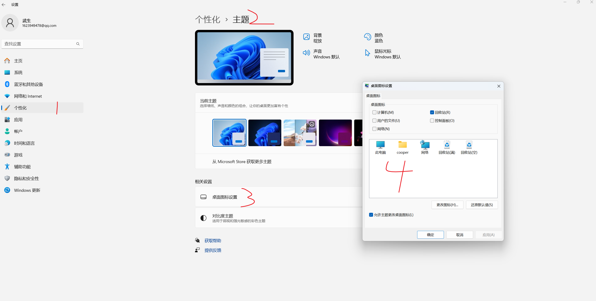
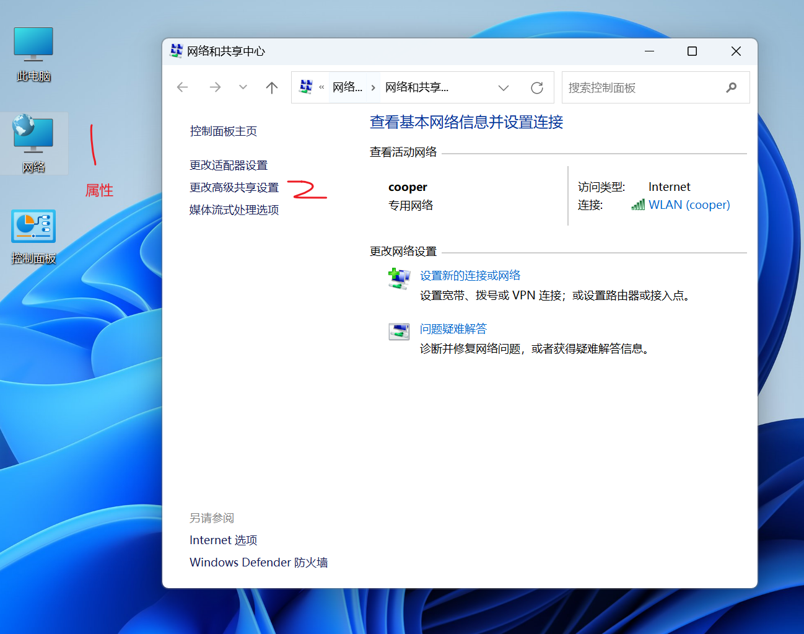
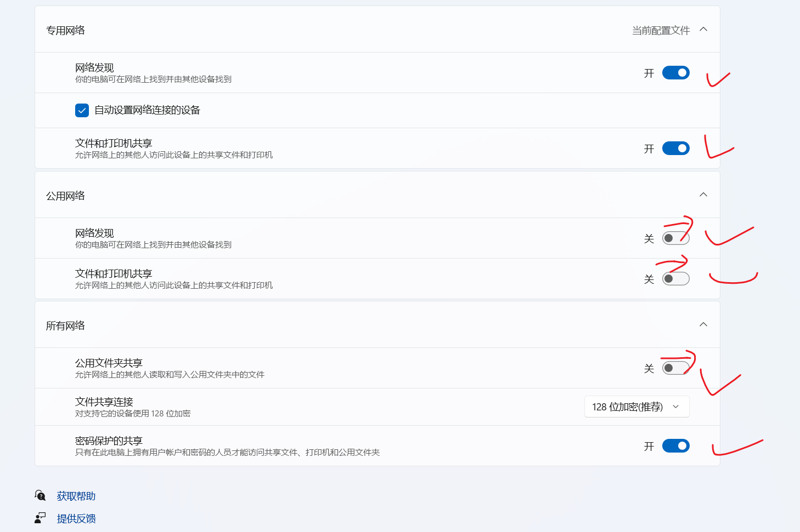
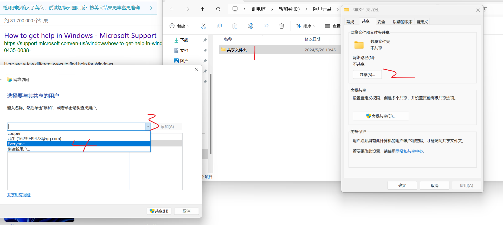

- [我的电脑怎么在桌面显示](#我的电脑怎么在桌面显示)
- [同一个局域网内，使用共享文件在两个电脑之间传输文件](#同一个局域网内使用共享文件在两个电脑之间传输文件)

# 我的电脑怎么在桌面显示
1. 在电脑桌面空白处，点击鼠标右键，选择“个性化”。
2. 进入个性化设置页面后，点击左侧的“主题”选项。
3. 在主题页面中，找到并点击“桌面图标设置”。

# 同一个局域网内，使用共享文件在两个电脑之间传输文件
1. 在第一台电脑（一般是需要放文件的电脑）

2. 设置

3. 新建共享文件夹
- 新建一个文件夹，名称随意
- 
- 将权限改为 读+写，保存。
4. 在第二台电脑
在网络中找到刚才共享的计算机，找到对应的文件夹即可。

